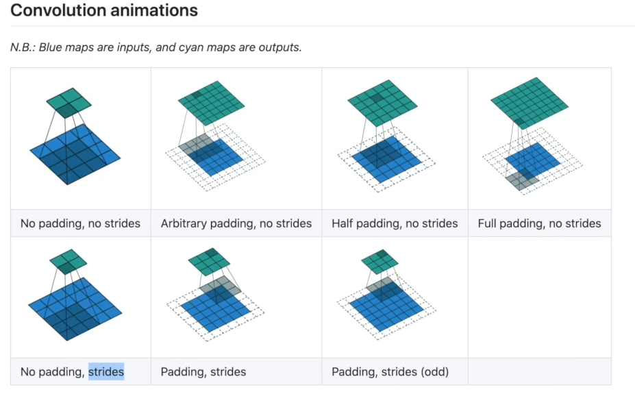

##### 2024/10/14    贾国强
### python两大法宝函数
+ help()
+ dir()

### 换国内源
> pip install numpy -i https://pypi.tuna.tsinghua.edu.cn/simple

### 打开tensorboard生成的logs文件，并指定端口
> tensorboard --logdir=logs --port=6007
### 这干啥用的啊tensorboard？
1. 内置于 TensorFlow 的可视化方案 — TensorBoard
2. 机器学习过程可视化

### tensor的用法
通过transforms.ToTensor去看两个个问题
1. transforms该如何使用  
tensor_trans=transforms.ToTensor() #ToTensor是一个类，这里实例化对象
tensor_img =tensor_trans(img) #把img转成tensor类型
2. 为什么要使用Tensor数据类型  
好用，包含了一些基本属性

### from torchvision import transforms
1. 操作img
2. 转换数据格式PIL->tensor
3. 组合处理
4. 随机挑选img

### dataset 数据集---pytorch中已给的数据
### dataLoder 加载数据  
配合torchboard可视化使用  

## 神经网络 NN 使用
API：https://pytorch.org/docs/stable/nn.html#
### 卷积层

### 池化层 maxpool
卷积层的一种，提取数据特征

### 非线性变换
主要用来给网络中引入非线性特征，提高泛化能力